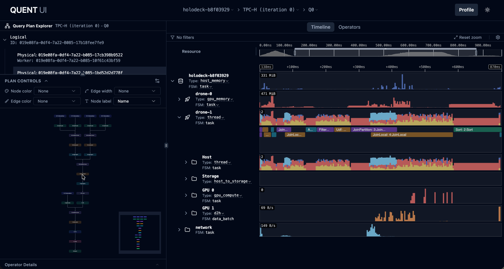
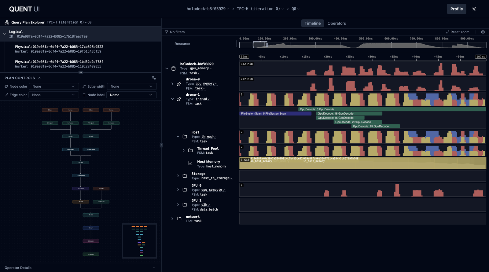
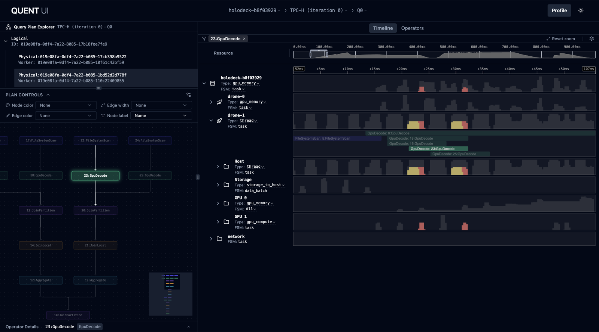
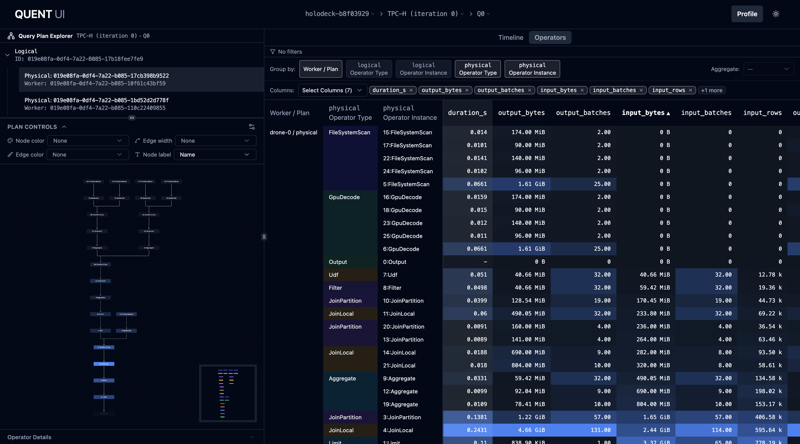
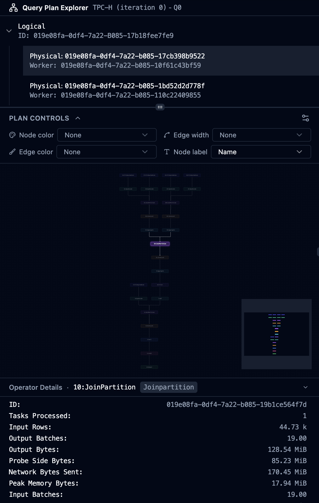
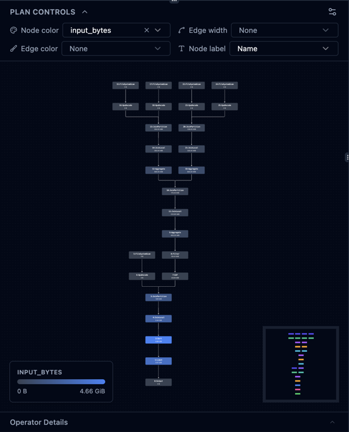

# Quent UI

A front end for query profiling instrumentation

## Screenshots



 *Timeline view reveals the structure
of resources in an interactive timeline tree. Timelines show resource usage over
time, operator active time spans, and individual entities at high zoom levels.*


*Interactive query plan DAG visualizations crossfilter resource timelines.*

 *Statistics captured
can be viewed in a pivot table view. Configurable to show statistics grouped by
different operator levels.*

| Query Plan DAG | Query Plan DAG Heatmap |
| --- | --- |
|  |  |

*A tree of query plans, viewable as an interactive DAG. DAG nodes and edges can
be configured to display a heatmap view of nodes based on collected statistics.*

## Tech Stack

- **React** - UI library
- **TypeScript** - Type safety
- **Vite** - Build tool and dev server
- **TanStack Router** - Type-safe routing
- **TanStack Query** - Data fetching and state management
- **ECharts** - Data visualization
- **echarts-for-react** - React wrapper for ECharts
- **Tailwind CSS** - Utility-first CSS framework
- **shadcn/ui** - Beautiful, accessible component library
- **Radix UI** - Unstyled, accessible component primitives
- **Lucide React** - Beautiful icon library

## Getting Started

### Prerequisites

- **Node.js 24.11.0** (enforced via `.nvmrc`, `.node-version`, and Volta)
  - Using nvm: `nvm use` or `nvm install`
  - Using volta: Automatically switches to correct version
  - Using asdf/nodenv: Uses `.node-version` file
- **pnpm 11.5.3** (pinned via `packageManager` and Volta; `>=11.5.3` required)
  - Install with `npm install -g pnpm@11.5.3` or see
  [pnpm installation](https://pnpm.io/installation)

### Installation

1. Clone the repository (or navigate to the project directory)

2. Install dependencies:

```bash
pnpm install
```

1. (Optional) Configure environment variables:

Create a `.env` file in the root directory and add your API endpoint:

```bash
VITE_API_BASE_URL=http://localhost:3000/api
```

### Development

Start the development server:

```bash
pnpm dev
```

The app will be available at `http://localhost:5173`

### Build

Build the production version:

```bash
pnpm build
```

### Preview

Preview the production build:

```bash
pnpm preview
```

## API Integration

The application includes stub API functions in `src/services/api.ts`. These
currently return mock data with simulated delays.

To integrate with a real backend:

1. Update the `VITE_API_BASE_URL` environment variable
2. Replace the mock implementations in `src/services/api.ts` with actual API
   calls
3. Adjust the data types and interfaces as needed

## Customization

### Styling

The application uses Tailwind CSS and shadcn/ui for styling. You can customize
the theme by editing the CSS variables in `src/index.css`:

```css
:root {
  --background: 0 0% 100%;
  --foreground: 222.2 84% 4.9%;
  --primary: 222.2 47.4% 11.2%;
  --secondary: 210 40% 96.1%;
  /* ... more variables */
}
```

You can also customize Tailwind's configuration in `tailwind.config.js` to
extend the default theme with custom colors, fonts, spacing, etc.

### Adding shadcn/ui Components

To add more shadcn/ui components to your project:

```bash
pnpm dlx shadcn@latest add [component-name]
```

For example:

```bash
pnpm dlx shadcn@latest add button
pnpm dlx shadcn@latest add dialog
pnpm dlx shadcn@latest add dropdown-menu
```

### Adding New Routes

1. Create a new file in `src/routes/` (e.g., `analytics.tsx`)
2. Define the route using `createFileRoute`
3. TanStack Router will automatically pick up the new route

## Available Scripts

- `pnpm dev` - Start development server
- `pnpm build` - Build for production
- `pnpm preview` - Preview production build
- `pnpm lint` - Run ESLint
- `pnpm lint:fix` - Fix ESLint errors and format code
- `pnpm format` - Format code with Prettier

## Development Tools

The application can render TanStack devtools for debugging:

- **TanStack Router Devtools** - Visual router debugging
- **TanStack Query Devtools** - Query state inspection

Both are off by default and gated behind the `VITE_DEBUG` env var, so they
won't appear in normal `pnpm dev` sessions or in production builds.

To enable them, start the dev server with `VITE_DEBUG=1`:

```bash
VITE_DEBUG=1 pnpm dev
```

To leave them on for every dev session on your machine, create a
`ui/.env.development.local` file (already gitignored via `*.local`):

```bash
VITE_DEBUG=1
```

Then a plain `pnpm dev` will pick it up. Restart the dev server after changing
env vars; Vite does not hot-reload `import.meta.env` changes.
